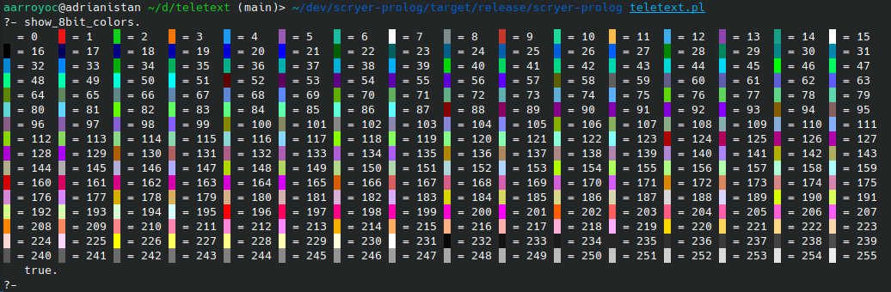

# Teletext
A library to ANSI Escape sequences in Scryer Prolog. You can use it to improve your UX in the terminal.

It doesn't allow building full-fledged TUI apps.

Currently it features a single non-terminal, `fmt_text_//2`.




## Documentation

### `fmt_text_(+GRBody, +Options)`

A non-terminal that produces an ANSI escaped sequence of the text with the requested Options.

Options must be a list and the supported options are:

- `bright` - Makes the text _brigther_
- `dim` - Makes the text _dimmer_
- `italic` - Makes the text show with italic font
- `underline` - Shows a line under the text
- `reverse` - Interchanges the foreground color and the background color
- `fg_color(+ColorName)` - Sets the foreground color to ColorName. Valid ColorNames are listed below.
- `fg_color(+NumColor)` - Sets the foreground color to an 8 bit Color. NumColor must be between 0 and 255.
- `fg_bright_color(+ColorName)` - Sets the foreground bright color to ColorName. Valid ColorNames are listed below.
- `bg_color(+ColorName)` - Sets the background color to ColorName. Valid ColorNames are listed below.
- `bg_color(+NumColor)` - Sets the background color to an 8 bit Color. NumColor must be between 0 and 255.
- `bg_bright_color(+ColorName)` - Sets the background bright color to ColorName. Valid ColorNames are listed below.

Valid color names are: black, red, green, yellow, blue, magenta, cyan and white.

## Example

```prolog
:- use_module(library(dcgs)).
:- use_module(library(pio)).

?- phrase_to_stream((fmt_text_("A", [fg_color(red)]), fmt_text_("B", [fg_color(134), italic])), user_output).
```
